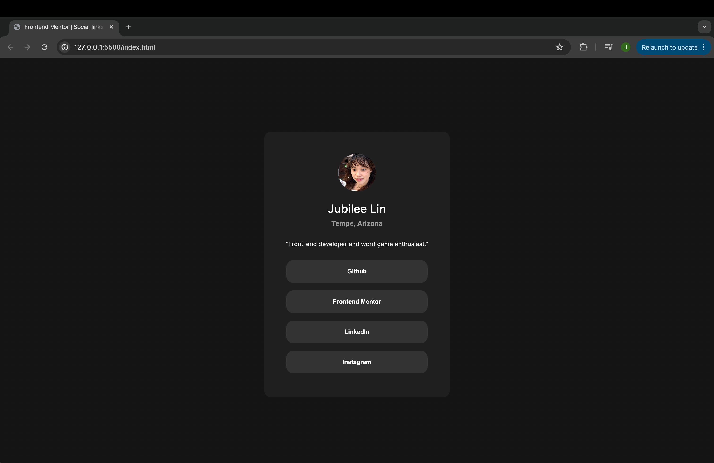

# Frontend Mentor - Social links profile solution

This is a solution to the [Social links profile challenge on Frontend Mentor](https://www.frontendmentor.io/challenges/social-links-profile-UG32l9m6dQ). Frontend Mentor challenges help you improve your coding skills by building realistic projects. 

## Table of contents

- [Overview](#overview)
  - [The challenge](#the-challenge)
  - [Screenshot](#screenshot)
  - [Links](#links)
  - [Built with](#built-with)
  - [What I learned](#what-i-learned)
  - [Continued development](#continued-development)
- [Author](#author)

### The challenge

Users should be able to:

- See hover and focus states for all interactive elements on the page

### Screenshot

### Links

- Solution URL: (https://your-solution-url.com)
- Live Site URL: ((https://jubileelin.github.io/social-links-profile/))

### Built with

- Semantic HTML5 markup
- CSS custom properties
- Flexbox
- CSS Grid

### What I learned

I tried to apply some knowledge that I learned from the last challenge about using different CSS units in order to create responsive designs and apply it to this design. 

### Continued development

I want to get more comfortable with using different CSS units, and maybe eventually learn CSS animations so I can make this profile more intriguing. I also want to try to implement mobile-first workflow into my design in accordance with what many companies are doing today.

**Note: Delete this note and the content within this section and replace with your own plans for continued development.**

## Author
- Frontend Mentor - [@jubileelin](https://www.frontendmentor.io/profile/jubileelin)
